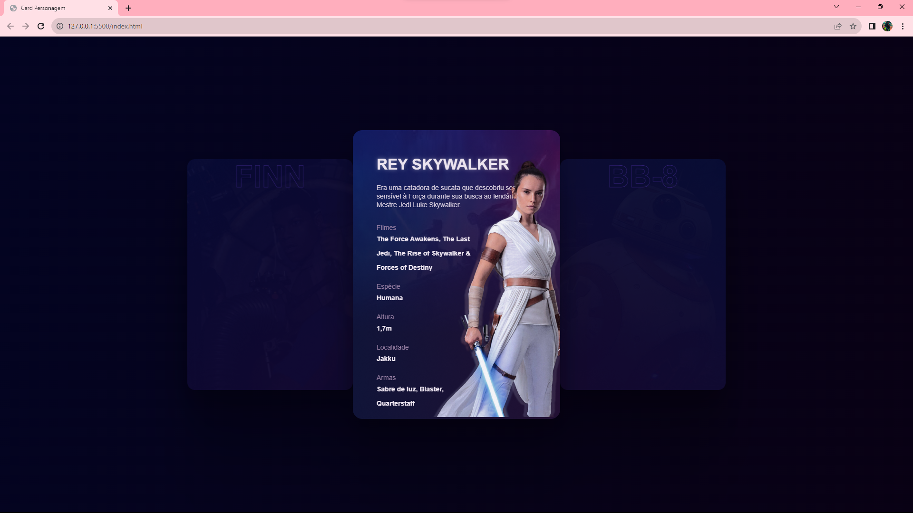

Card 3D de Personagem de Star Wars
Este mini projeto tem como objetivo praticar CSS3, criando um card 3D para representar uma personagem da franquia Star Wars.

Tecnologias utilizadas
HTML5
CSS3
Descrição do Projeto
O card 3D é uma representação visual da personagem de Star Wars, usando efeitos de rotação e sombreamento para criar uma aparência tridimensional. O objetivo é mostrar as habilidades em CSS3 e o conhecimento em design e layout para criar uma representação atraente do personagem.

Funcionalidades
Card interativo 3D que reage ao passar o mouse sobre ele.
Animação de rotação para criar o efeito 3D.
Detalhes sobre a personagem, como nome, raça, habilidades, entre outros.

Screenshots

Contribuindo
Se você gostou do projeto e deseja contribuir, sinta-se à vontade para abrir um pull request com suas melhorias e correções. Toda contribuição é bem-vinda!

Contato
Caso tenha alguma dúvida ou queira entrar em contato, você pode me encontrar no LinkedIn ou enviar um e-mail para [philipeagra.dev@gmail.com].

Aproveite o projeto e que a Força esteja com você! May the Force be with you! 🚀✨
